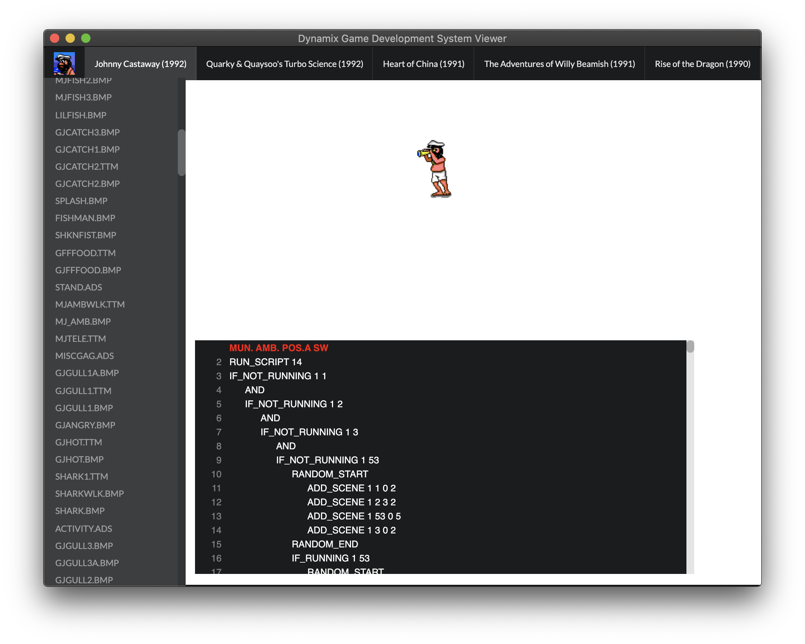
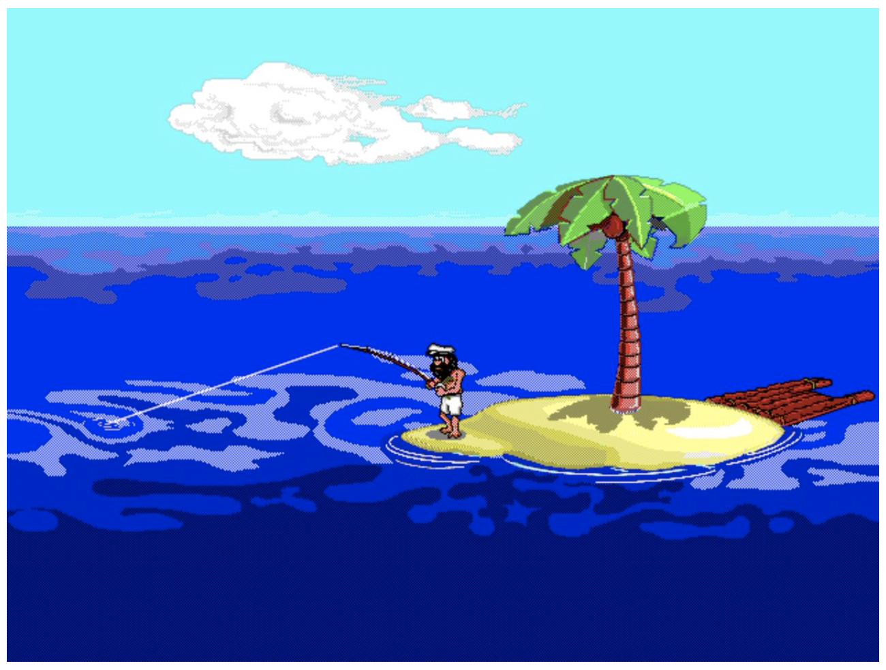
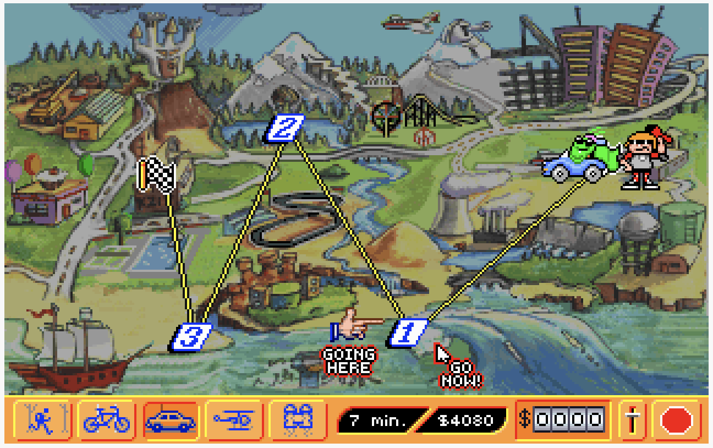
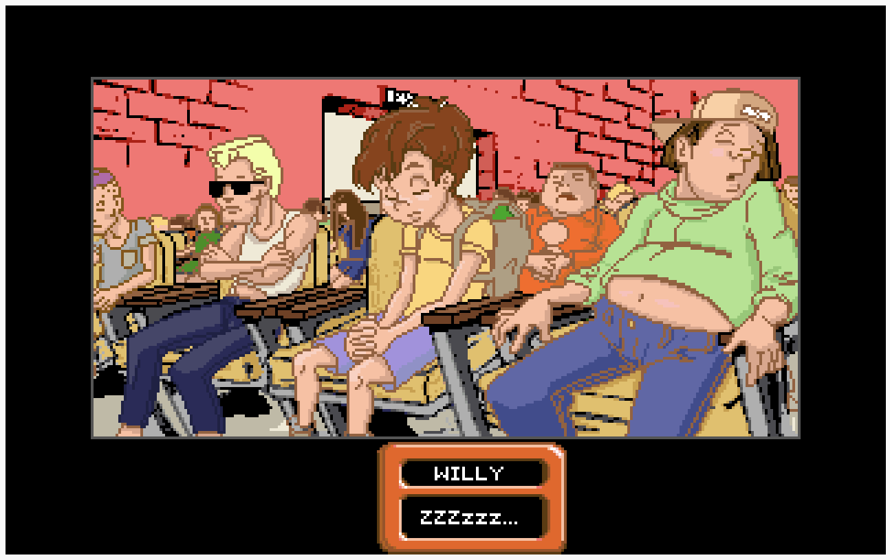
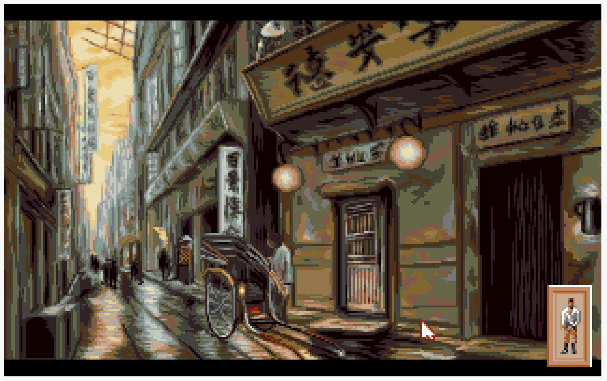
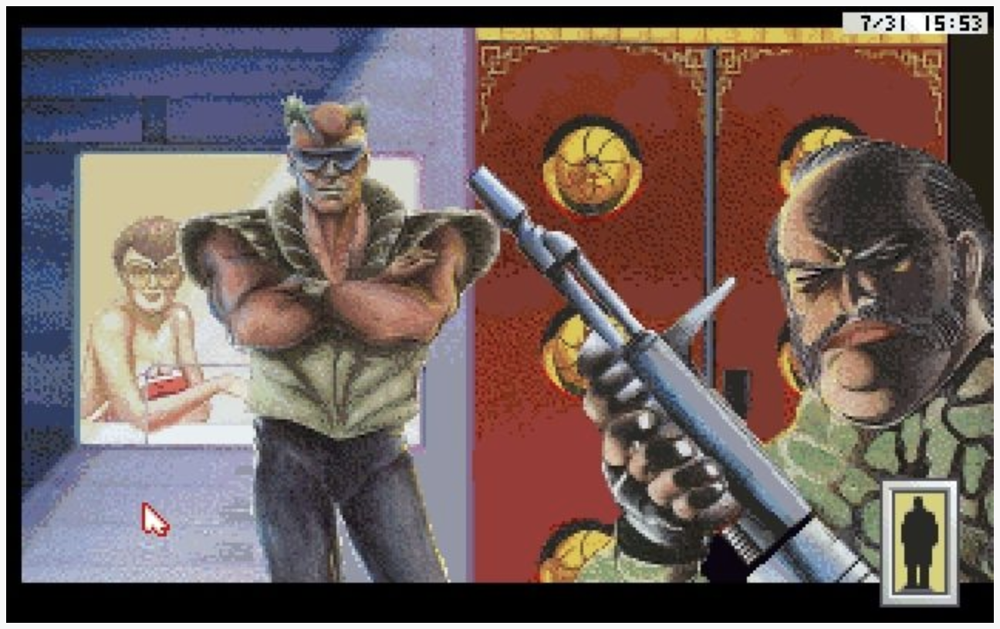

# dgds-viewer

The aim of this project is to provide resource viewer of the various games developed by Dynamix using their Dynamix Game Development System engine.

## Purpose

- Learn the Dynamix Game Development System (DGDS);

- Dump Resources on a more readable format;

- Document the files format used;

- Build tools using NodeJS;

- Focus on taking advantage of the modern web development languages and frameworks like Javascript and React;

- Use as a sandbox to try new features of those frameworks during the process;

- Have fun implementing it!!

## Documents

[Resource Index File Format](docs/resindex.md)

## Games

### Johnny Castaway Screen Saver (1992)

### Quarky & Quaysoo's Turbo Science (1992)

### The Adventures of Willy Beamish (1991)

### Heart of China (1991)

### Rise of the Dragron (1990)

## Usage

This project uses node, yarn and lerna CLI to manage multiple applications and packages in a mono repository.

Install:
* nodejs: https://nodejs.org/en/
* yarn: https://yarnpkg.com/en/

Run this commands in the root folder:

> yarn install

### Viewer

This application allows you to browse through the resources and play them.

> yarn start

### Dump Resources

This application allows you to extract the resources of Johnny Castaway. A data/dump folder will be created when application is executed.

> yarn dump
